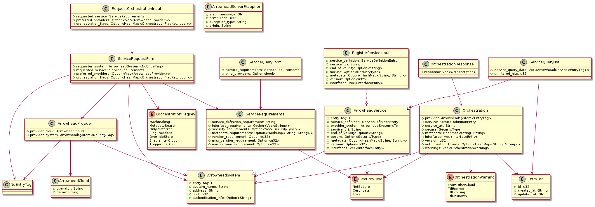

# client-adapter-rust

## Overview
The _client-adapter-rust_ software package enables application developers and system integrators to create distributed IIoT solutions in compliance with the Arrowhead framework specification by delivering client-side implementation of the mandatory Arrowhead core services (version 4.4.0). _client-adapter-rust_ is written in Rust and makes use of open source libraries available on [crates.io](https://crates.io/). It is released both as a software library for application developers and as executable configuration tool for system integrators. 

### Qt/C++ implementation
This software is develped upon a specification which is (roughly) the same as that of _client-adapter-qt_ which is released under GNU LGPL license and is available [here](https://github.com/arrowhead-f/client-adapter-qt).
The key differences are the following:
- _client-adapter-rust_ only providers interface for mandatory core systems (Service Registry, Orchestrator and Authorization) while _client-adapter-qt_ makes use of onboarding core systems (Onboarding Controller, Device Registry, System Registry) too.
- _client-adapter-qt_ also contains pre-built Docker images for easier deployment

## Getting started

### Build from source

_client-adapter-rust_ consists of two [Cargo projects](https://doc.rust-lang.org/cargo/) (_ah_system_adapter_ and _ah_adapter_app_). You can use standard Cargo commands (`cargo build`, `cargo run`, `cargo test`) to build, execute or test the source code.

To learn more about the installation of Cargo, follow [this link](https://doc.rust-lang.org/cargo/getting-started/installation.html).

## Documentation
## Table of Contents

- [ah_system_adapter](#ah_system_adapter)
- [ah_adapter_app](#ah_adapter_app)
  - [User manual](#user-manual)
  - [Developer manual](#developer-manual)

# ah_system_adapter

_ah_system_adapter_ is a Cargo package containing a library crate with the same name. It also contains some related unit tests.

## Prerequisites
The reader is required to have a good understanding of the Arrowhead framework before using _ah_system_adapter_. Please consult the [Arrowhead core repository](https://github.com/arrowhead-f/core-java-spring) for detailed documentation with special focus on the [_Service Registry_](https://github.com/arrowhead-f/core-java-spring/blob/master/README.md#serviceregistry), [_Authorization_](https://github.com/arrowhead-f/core-java-spring/blob/master/README.md#authorization) and [_Orchestrator_](https://github.com/arrowhead-f/core-java-spring/blob/master/README.md#orchestrator) core systems and their public client services.

## Specification
- Implements Arrowhead client functionalities
  - Client-side implementation of mandatory core services
  - Supported Arrowhead version: 4.4.0
- Supported core interfaces
  - Service Registry interface
    - echo
    - register
    - unregister
    - query
  - Authorization interface
    - echo
    - get public key
  - Orchestrator interface
    - echo
    - request orchestration
    - start store orchestration by id
  - Target users:
    - software developers responsible for creating Arrowhead-compliant application systems and services

### Warning
> This library currently only supports unsecured HTTP connection, so Arrowhead Systems must be configured that way. 

## Initialization
The library must be initialized by instantiating a _ArrowheadSystemAdapter_ struct using _ArrowheadSystemAdapter::new()_ method.

The method requires the following parameters:
* `service_registry_address: &str` - the base URL of the Service Registry core system,
* `authorization_address: &str` - the base URL of the Authorization core system,
* `orchestrator_address: &str` - the base URL of the Orchestrator core system,
* `client_system: ArrowheadSystem<NoEntryTag>` - the specification of the client system, which will be adapted to the Arrowhead local cloud.

## Interface description
The interface struct _ArrowheadSystemAdapter_ has the following public functions:
- [echo_service_registry](#echo_service_registry)
- [query_service](#query_service)
- [register_service](#register_service)
- [unregister_service](#unregister_service)
- [echo_authorization_system](#echo_authorization_system)
- [get_public_key](#get_public_key)
- [echo_orchestrator](#echo_orchestrator)
- [request_orchestration](#request_orchestration)
- [request_orchestration_by_id](#request_orchestration_by_id)

The library performs blocking network calls. Each interface function returns a `Result<T, Error>` enum (referenced as `Result<T>` from this on) where T (a template parameter) is the return type of the different functions. The error enum `Error` has the following variants:

|Variant     |Meaning|
|:----------------|:--------|
|`Error::HttpError(String)`  |An HTTP-related error occured when trying to send request|
|`Error::ArrowheadError(ArrowheadServerException)`  |The the request to the Arrowhead Service returned with an Arrowhead-specific client error|

## echo_service_registry
---
### Signature
```rust
fn echo_service_registry() -> Result<()>
```

### Description
The _echo_service_registry_ function tests connection to the Service Registry by using its _Echo_ interface.

## query_service
---
### Signature
```rust
fn query_service(service_query_form: &ServiceQueryForm) -> Result<ServiceQueryList>
```

### Description
The _query_service_ function queries the Service Registry for the presence of the indicated service.

### Notes
> Direct lookups from Application Systems within the network is not advised in [Arrowhead generation 4.4.0](https://github.com/arrowhead-f/core-java-spring/tree/development#service-registry), due to security reasons.

## register_service
---
### Signature
```rust
fn register_service(register_service_input: RegisterServiceInput) - Result<ArrowheadService<EntryTag>>
```

### Description
The _register_service_ function registers an application service to the Service Registry.


## unregister_service
---
### Signature
```rust
fn unregister_service(service_definition: &str) -> Result<()>
```

### Description
The _unregister_service_ function deregisters from the Service Registry the application service defined by the _service_definition_ input argument.


## echo_authorization
---
### Signature
```rust
fn echo_authorization_system() -> Result<()>
```

### Description
The _echo_authorization_system_ function tests connection to the Authorization System by using its _Echo_ interface.

## get_public_key
---
### Signature
```rust
fn get_public_key() -> Result<String>
```

### Description
The _get_public_key_ function returns the public key of the Authorization System as a base64 encoded string.

### Notes
> Only applicable with SSL enabled.


## echo_orchestrator
---
### Signature
```rust
fn echo_orchestrator() -> Result<()>
```

### Description
The _echo_orchestrator_ function tests connection to the Orchestrator by using its _Echo_ interface.

## request_orchestration
---
### Signature
```rust
fn request_orchestration(request_orchestration_input: RequestOrchestrationInput) -> Result<OrchestrationResponse>
```

### Description
The _request_orchestration_ function requests service orchestration from the Orchestrator.

### Notes
> The default orchestration-method is store-based orchestration. Dynamic orchestration request shall be specified by setting the _overrideStore_ orchestration flag in the [_RequestOrchestrationInput_](https://github.com/arrowhead-f/core-java-spring#datastructures_servicerequestform). See the [Arrowhead core documentation](https://github.com/arrowhead-f/core-java-spring#dynamic-orchestration-1) for further details.


## request_orchestration_by_id
---
### Signature
```rust
fn request_orchestration_by_id(id: i64) -> Result<OrchestrationResponse>
```

### Description
The _request_orchestration_by_id_ function requests service orchestration from the Orchestrator using the store entry id of the requester system.

## Data Types
The data structs implemented by the library are specified by the requested Arrowhead core services. The definition of the input forms and output responses can be found in the [Arrowhead core documentation](https://github.com/arrowhead-f/core-java-spring#documentation).
The Class Diagram of the library is presented in Figure 1:


*Figure 1 - ah_system_adapter Data Types Class Diagram*


# ah_adapter_app

_ah_adapter_app_ is a Cargo package containing a binary crate with the same name.

It provides an easy-to-use command line interface for:

  - service registration/deregistration
  - public key request for the system
  - orchestration request

## User manual

Please follow [this link](ah_adapter_app/doc/ah_adapter_app_user_manual.md) for the User manual.

## Developer manual
Please follow [this link](ah_adapter_app/doc/ah_adapter_app_developer_manual.md) for the Developer manual.
