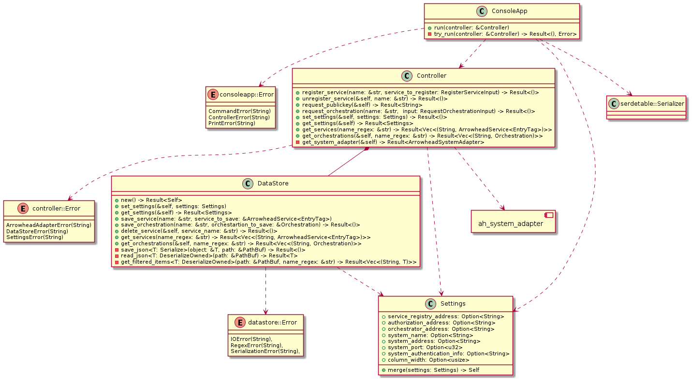

# ah_adapter_app
## Developer manual
### Classes
The Class Diagram of the application is presented in Figure 1:


*Figure 1 - ah_adapter_app Class Diagram*

#### Main structs
##### ConsoleApp
The struct **ConsoleApp** reads the commands from the standard input, validates them, calls the corresponding functions of class Controller and shows help for each command .
###### Responsibilites:
- Reading user input
- Validating commands
- Making the proper calls to Controller
- Showing data returned from Controller
- Showing help for the commands
##### Controller
The struct **Controller** provides an interface for using the Arrowhead Framework mandatory core systems using the *ah_system_adapter* library.
###### Responsibilites:
- Providing interface for
  - registering/unregistering services
  - requesting the public key of the system
  - requesting system orchestrations
  - setting user preferences
  - getting information about previously registered services, system orchestrations and preferences
###### Main fuctions:
- ```fn register_service(&self, name: &str, service_to_register: RegisterServiceInput) -> Result<()>```: Registers a service on the Arrowhead Local Cloud and saves its data in the filesystem.
- ```fn unregister_service(&self, name: &str) -> Result<()>```: Unregisters a service on the Arrowhead Local Cloud and removes its data from the filesystem.
- ```fn request_publickey(&self) -> Result<String>```: Returns the public key of the Authorization System as a base64 encoded string.
- ```fn request_orchestration(&self, name: &str, input: RequestOrchestrationInput) -> Result<()>```: Requests orchestration for the system using the given data and saves its data in the filesystem.
- ```fn request_orchestration_id(&self, name: &str, id: i64) -> Result<()>```: Requests store orchestration of given id for the system and saves its data in the filesystem.
- ```fn set_settings(&self, settings: Settings) -> Result<()>```: Sets user preferences.
- ```fn get_settings(&self) -> Result<Settings>```: Returns previously set user preferences. 
- ```fn get_services(&self, name_regex: &str) -> Result<Vec<(String, ArrowheadService<EntryTag>)>>```: Returns the previously registered services (and their names) with a name that mathches the given regex filter.
- ```fn get_orchestrations(&self, name_regex: &str) -> Result<Vec<(String, Orchestration)>>```: Returns the previously requested orchestrations (and their names) with a name that mathches the given regex filter.
##### DataStore
The struct **DataStore** is used to save app data in the filesystem and read it back.
###### Responsibilites:
- Providing interface for
  - saving/loading/removing services
  - saving/loading orchestrations/settings
- Saving/reading data on the disk
##### Settings
The struct **Settings** is used to represent user preferences of the application.
###### Responsibilites:
- Providing interface for merging two **Settings** struct to one by overwriting non-empty fields.
- Realizing its (de)serialization by implementing *serde*'s ```Serialize``` and ```Deserialize``` traits
##### serde_table::Serializer
The struct **serde_table::Serializer** is used print serializable objects (like **ArrowheadService**, **Orchestration** and **Settings**) in a human-readable format.
###### Responsibilites:
- Providing serializer functions for each abstract data type by implementing *serde*'s ```Serializer``` trait.
